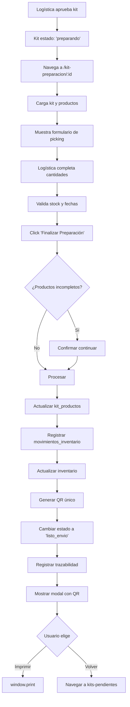

# FASE 2 - PREPARACIÓN DE KIT QUIRÚRGICO

## 📋 IMPLEMENTACIÓN COMPLETA

### **Componente:** `kit-preparacion.component.ts`
**Ruta:** `/internal/logistica/kit-preparacion/:id`

---

## 🎯 FUNCIONALIDADES IMPLEMENTADAS

### 1. **Carga de Datos del Kit**
- Obtiene kit completo con productos, cirugía, hospital y cliente
- Carga inventarios disponibles por ubicación para cada producto
- Calcula stock total disponible por producto
- Detecta automáticamente alertas de stock y vencimiento

### 2. **Validaciones Automáticas**

#### **Alerta de Stock Insuficiente**
```typescript
alertaStock = stockTotal < cantidad_solicitada
```
- ⚠️ Muestra badge rojo si no hay suficiente inventario
- Impide preparar más de lo disponible

#### **Alerta de Vencimiento Próximo**
```typescript
alertaVencimiento = diasRestantes <= 30
```
- ⚠️ Muestra badge naranja si el producto vence en menos de 30 días
- Alerta visual para productos próximos a vencer

### 3. **Formulario de Preparación (Picking)**

Por cada producto se captura:

| Campo | Tipo | Validación | Descripción |
|-------|------|------------|-------------|
| `cantidad_preparada` | Number | 0 ≤ cantidad ≤ stock_disponible | Cantidad física preparada |
| `ubicacion_seleccionada` | Select | Requerido | De qué bodega/ubicación se toma |
| `lote` | Text | Opcional | Código del lote físico |
| `fecha_vencimiento` | Date | Opcional | Fecha de vencimiento del lote |
| `observaciones` | Textarea | Opcional | Notas sobre el producto |

**Validación de cantidad:**
```typescript
validarCantidad(producto) {
  if (cantidad > stock_disponible) {
    cantidad = stock_disponible;
    alert('Stock insuficiente');
  }
}
```

### 4. **Proceso de Finalización**

Al hacer clic en "Finalizar Preparación":

#### **Paso 1: Validación**
- Verifica que al menos 1 producto tenga `cantidad_preparada > 0`
- Si hay productos incompletos → muestra confirmación

#### **Paso 2: Actualizar `kit_productos`**
```sql
UPDATE kit_productos SET
  cantidad_preparada = X,
  lote = 'LOTE-2025-001',
  fecha_vencimiento = '2026-05-15',
  observaciones = 'Notas...'
WHERE id = producto_id;
```

#### **Paso 3: Registrar Movimientos de Inventario**
Por cada producto preparado:
```sql
-- Movimiento de salida
INSERT INTO movimientos_inventario (
  inventario_id,
  producto_id,
  tipo,
  cantidad,
  motivo,
  usuario_id,
  ubicacion_origen,
  referencia,
  lote,
  fecha_vencimiento,
  observaciones
) VALUES (
  inv_id,
  prod_id,
  'salida',
  cantidad_preparada,
  'Kit quirúrgico',
  user_id,
  'bodega_principal',
  'KIT-001',
  'LOTE-XXX',
  '2026-05-15',
  'Kit KIT-001 - Preparación para cirugía'
);

-- Actualizar inventario
UPDATE inventario SET
  cantidad = cantidad - cantidad_preparada,
  estado = CASE 
    WHEN cantidad - cantidad_preparada <= 0 THEN 'agotado' 
    ELSE 'disponible' 
  END
WHERE id = inv_id;
```

#### **Paso 4: Generar QR Único**
```typescript
// Formato: KIT-{numero_kit}-{random}-{timestamp}
qrCode = `KIT-${kit.numero_kit}-A7B2C3-1728394857000`;

// Guardar en tabla qr_codes
INSERT INTO qr_codes (
  codigo,
  tipo,
  referencia_id,
  kit_id,
  tipo_validacion,
  es_activo
) VALUES (
  qrCode,
  'kit',
  kit_id,
  kit_id,
  'entrega_cliente',
  true
);
```

#### **Paso 5: Cambiar Estado del Kit**
```sql
UPDATE kits_cirugia SET
  estado = 'listo_envio',
  fecha_preparacion = NOW(),
  logistica_id = user_id,
  qr_code = 'KIT-001-A7B2C3-...',
  ubicacion_actual = 'bodega_principal',
  observaciones = 'Observaciones generales...'
WHERE id = kit_id;
```

#### **Paso 6: Registrar Trazabilidad**
```sql
INSERT INTO kit_trazabilidad (
  kit_id,
  accion,
  estado_anterior,
  estado_nuevo,
  usuario_id,
  ubicacion,
  observaciones
) VALUES (
  kit_id,
  'Listo para despacho',
  'preparando',
  'listo_envio',
  user_id,
  'bodega_principal',
  'Observaciones...'
);
```

### 5. **Modal de Confirmación con QR**

Al finalizar exitosamente:
- ✅ Muestra modal con QR generado
- ✅ Código QR visible (simulado con SVG)
- ✅ Botón "Imprimir QR" (window.print())
- ✅ Botón "Volver al Listado"

---

## 📊 INTERFAZ DE USUARIO

### **Header**
- Logo Implameq
- Botón "Volver" a kits pendientes

### **Información del Kit**
Card con:
- Número de kit
- Número de cirugía
- Hospital
- Fecha programada
- **Estadísticas:** X/Y Productos Completos
- **Alertas:** Icono ⚠️ si hay problemas

### **Lista de Productos**
Por cada producto, card glassmorphism con:

**Header:**
- Nombre del producto (grande, bold)
- Código
- Badge de alerta (verde/naranja/rojo)
- Cantidad solicitada (grande, amarillo)

**Formulario:**
- Input de cantidad (con validación en tiempo real)
- Select de ubicación (muestra stock por ubicación)
- Input de lote
- Input de fecha vencimiento
- Textarea de observaciones

**Colores:**
- ✅ Verde: Stock suficiente, sin problemas
- ⚠️ Naranja: Producto próximo a vencer (<30 días)
- ❌ Rojo: Stock insuficiente

### **Observaciones Generales**
Textarea grande para notas del kit completo

### **Botón Principal**
- Grande, amarillo (#C8D900)
- "Finalizar Preparación"
- Loading state mientras procesa
- Disabled mientras está procesando

---

## 🔄 FLUJO COMPLETO



---

## 🎨 ESTILOS IMPLEMENTADOS

**Paleta Implameq:**
- Navy: `#10284C` (fondos)
- Turquoise: `#0098A8` (cards, acentos)
- Yellow-Green: `#C8D900` (botones primarios, títulos)

**Efectos:**
- Glassmorphism: `backdrop-blur-md` + `border-white/20`
- SVG backgrounds con formas geométricas
- Transiciones suaves en hover
- Active states con `scale-95`

---

## 📱 SIGUIENTE FASE: RECEPCIÓN POR CLIENTE

### **Flujo del QR:**

1. **Kit preparado** → QR impreso y pegado en kit físico
2. **Mensajero entrega** kit al hospital/cliente
3. **Cliente recibe** kit con QR visible
4. **Cliente escanea QR** desde su smartphone:
   - Abre app o web móvil
   - Usa cámara para escanear
   - Sistema busca kit por `qr_codes.codigo`
5. **Cliente ve pantalla de validación:**
   - Nombre del kit
   - Lista de productos con cantidades
   - Checkbox "He verificado el contenido"
   - Canvas para firma digital
   - Botón "Aprobar Recepción"
6. **Cliente firma y aprueba:**
   ```sql
   INSERT INTO qr_escaneos (
     qr_code_id,
     usuario_id,
     tipo_accion,
     validado_por_nombre,
     firma_digital,
     kit_id,
     ubicacion,
     resultado
   ) VALUES (
     qr_id,
     null, -- Cliente no tiene usuario
     'recepcion_kit',
     'Dr. Juan Pérez',
     firma_base64,
     kit_id,
     'Hospital San José',
     'exitoso'
   );
   
   UPDATE kits_cirugia SET
     estado = 'entregado',
     fecha_recepcion = NOW(),
     cliente_receptor_nombre = 'Dr. Juan Pérez',
     cliente_receptor_cedula = '1234567890',
     cliente_validacion_fecha = NOW(),
     cliente_validacion_qr = qr_code
   WHERE id = kit_id;
   ```

7. **Sistema registra:**
   - Timestamp de recepción
   - Nombre y cédula de quien recibió
   - Firma digital (base64)
   - Ubicación GPS (opcional)
   - Foto de evidencia (opcional)

---

## ✅ CAMPOS DE BD UTILIZADOS

### **Tabla: `kit_productos`**
- ✅ `cantidad_preparada` - Actualizado
- ✅ `lote` - Actualizado
- ✅ `fecha_vencimiento` - Actualizado
- ✅ `observaciones` - Actualizado

### **Tabla: `kits_cirugia`**
- ✅ `estado` - Cambiado a 'listo_envio'
- ✅ `fecha_preparacion` - Timestamp
- ✅ `logistica_id` - Usuario que preparó
- ✅ `qr_code` - QR generado
- ✅ `ubicacion_actual` - 'bodega_principal'
- ✅ `observaciones` - Notas generales

### **Tabla: `movimientos_inventario`**
- ✅ Registra salida por cada producto
- ✅ Tipo: 'salida'
- ✅ Motivo: 'Kit quirúrgico'
- ✅ Referencia: numero_kit

### **Tabla: `inventario`**
- ✅ `cantidad` - Decrementada
- ✅ `estado` - Cambiado a 'agotado' si cantidad = 0

### **Tabla: `kit_trazabilidad`**
- ✅ Evento "Listo para despacho"
- ✅ Estado anterior: 'preparando'
- ✅ Estado nuevo: 'listo_envio'

### **Tabla: `qr_codes`**
- ✅ Nuevo registro con código único
- ✅ Tipo: 'kit'
- ✅ `tipo_validacion`: 'entrega_cliente'
- ✅ `es_activo`: true

---

## 🚀 PRÓXIMOS COMPONENTES A DESARROLLAR

### 1. **kit-despacho.component** (Opcional - para después)
- Lista de kits listos para envío (`estado = 'listo_envio'`)
- Asignación de mensajero
- Generación de remisión PDF
- Cambio a estado `'en_transito'`

### 2. **kit-recepcion-cliente.component** (PRIORITARIO)
- Pantalla pública/móvil para escaneo de QR
- Muestra productos del kit
- Canvas para firma digital
- Captura foto de evidencia
- Botón "Aprobar Recepción"
- Cambia estado a `'entregado'`

### 3. **cirugia-ejecucion.component** (Técnico)
- Iniciar cirugía (estado `'en_uso'`)
- Registro de consumos en tiempo real
- Auto-guardar hoja de gastos
- Finalizar cirugía

### 4. **kit-devolucion.component** (Logística)
- Escanear QR de devolución
- Validar productos devueltos
- Procesos de lavado/esterilización
- Reposición a inventario

---

## 📝 NOTAS TÉCNICAS

### **Performance:**
- Carga todos los datos en una sola query (con joins)
- Usa signals para reactividad eficiente
- Computed properties para estadísticas

### **Validaciones:**
- Frontend: Validación en tiempo real de cantidades
- Backend: Constraints en BD garantizan integridad

### **Trazabilidad:**
- Cada cambio de estado registra en `kit_trazabilidad`
- Cada movimiento de inventario queda documentado
- QR único garantiza autenticidad

### **Seguridad:**
- Usuario autenticado requerido
- Solo rol 'logistica' puede acceder
- Transacciones atómicas en BD

---

## 🎯 ESTADO ACTUAL

✅ **FASE 1 - Comercial:** Kit creado con estado 'solicitado'
✅ **FASE 2 - Preparación:** IMPLEMENTADA COMPLETAMENTE
⏳ **FASE 3 - Recepción:** Por implementar
⏳ **FASE 4 - Ejecución:** Por implementar
⏳ **FASE 5 - Cierre:** Por implementar
⏳ **FASE 6 - Devolución:** Por implementar
⏳ **FASE 7 - Facturación:** Ya existe parcialmente

**Próximo paso recomendado:** Implementar componente de recepción con escaneo de QR para clientes.
