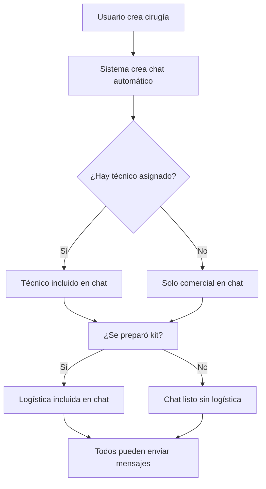

# 💬 CÓMO FUNCIONA EL CHAT - SmartTrack

## 🎯 Concepto Principal

El chat **NO es independiente**, está **vinculado automáticamente a cada cirugía**.

```
Cirugía → Chat automático → Participantes incluidos
```

---

## 👥 ¿Quién puede chatear?

Cada chat incluye automáticamente a:

1. **Comercial** → Quien creó la cirugía
2. **Técnico** → Asignado a la cirugía
3. **Logística** → Quien preparó el kit
4. **Admin** → Acceso total

---

## 🚀 ¿Cómo acceder al chat?

### Opción 1: Desde Agenda (PRINCIPAL)

```
1. Ir a /internal/agenda
2. Ver lista de cirugías
3. Clic en botón "Chat" 💬 (nuevo botón agregado)
4. Se abre el chat de esa cirugía
```

**Botones agregados:**
- ✅ Botón **Chat** en cada card de cirugía (vista lista)
- ✅ Icono de chat con color brand (#0098A8)
- ✅ 3 botones: Editar | Estado | Chat

### Opción 2: Desde Home

```
1. Ver badge de "Mensajes" en home
2. Clic en card "Mensajes"
3. Se abre lista de chats activos
4. Seleccionar una cirugía
```

---

## 📊 Flujo Completo



---

## 💡 Casos de Uso

### Caso 1: Cirugía nueva
```
1. Comercial crea cirugía CIR-001
2. Asigna técnico Juan
3. Chat automático entre Comercial + Juan
4. Juan va a Agenda → Clic en Chat
5. Puede comunicarse con Comercial
```

### Caso 2: Preparación de kit
```
1. Cirugía CIR-001 ya existe
2. Logística María prepara kit
3. María ahora ve el chat en /internal/chat
4. Puede comunicarse con Comercial y Técnico
```

### Caso 3: Sin mensajes
```
1. Usuario va a /internal/chat
2. Ve "No hay conversaciones activas"
3. Instrucciones claras:
   - Ir a Agenda
   - Seleccionar cirugía
   - Clic en Chat
```

---

## 🎨 UI Actualizada

### Vista Lista de Agenda

**ANTES:**
```
┌─────────────────────────────────┐
│ CIR-001 | Programada             │
│ ─────────────────────────────── │
│ [Ver Detalle]                   │
│ [Editar] [Cambiar Estado]       │
└─────────────────────────────────┘
```

**DESPUÉS:**
```
┌─────────────────────────────────┐
│ CIR-001 | Programada             │
│ ─────────────────────────────── │
│ [Ver Detalle]                   │
│ [Editar] [Estado] [💬 Chat]     │
└─────────────────────────────────┘
```

### Vista Mensajes (Empty State)

**ANTES:**
```
😶 No hay chats
Los chats aparecerán cuando haya mensajes
```

**DESPUÉS:**
```
┌─────────────────────────────────┐
│ 💬 No hay conversaciones activas │
│                                  │
│ 💡 ¿Cómo iniciar un chat?        │
│ 1. Ve a Agenda                   │
│ 2. Selecciona una cirugía        │
│ 3. Haz clic en Chat              │
│                                  │
│ [📅 Ir a Agenda]                 │
└─────────────────────────────────┘
```

---

## 🔍 Ventajas del Diseño

### ✅ Ventaja 1: Contexto automático
- No necesitas "crear" chats
- Cada cirugía = 1 chat automático
- Participantes agregados automáticamente

### ✅ Ventaja 2: Sin configuración
- No hay botón "Nuevo chat"
- No hay selector de participantes
- Todo basado en roles y asignaciones

### ✅ Ventaja 3: Seguridad RLS
- Solo ves chats de TUS cirugías
- Comercial ve cirugías que creó
- Técnico ve cirugías asignadas
- Logística ve cirugías con kits preparados

### ✅ Ventaja 4: Zero mensajes perdidos
- Cada mensaje vinculado a cirugía
- Historial completo por caso
- Fácil auditoría y seguimiento

---

## 📱 Experiencia del Usuario

### Usuario Comercial
```
1. Creo cirugía para mañana
2. Voy a Agenda → Clic Chat
3. Escribo: "Material confirmado ✅"
4. Técnico recibe notificación
```

### Usuario Técnico
```
1. Me asignan cirugía CIR-001
2. Veo badge "1 mensaje nuevo" en home
3. Clic en Mensajes
4. Leo: "Material confirmado ✅"
5. Respondo: "Perfecto, llego a las 8"
```

### Usuario Logística
```
1. Preparo kit para CIR-001
2. Automáticamente entro al chat
3. Envío: "Kit listo para envío 📦"
4. Comercial y Técnico reciben mensaje
```

---

## 🚀 Siguientes Mejoras (Futuras)

### V2: Notificaciones Push
```javascript
// Cuando llega mensaje nuevo
if (Notification.permission === 'granted') {
  new Notification('Nuevo mensaje en CIR-001');
}
```

### V3: Botón flotante en detalle
```
Agenda > Detalle > [Botón flotante Chat]
```

### V4: Preview en lista
```
CIR-001 | "Material confirmado ✅" | Hace 5 min
```

---

## ✅ Estado Actual

| Funcionalidad | Estado |
|--------------|--------|
| Chat por cirugía | ✅ Implementado |
| Acceso desde Agenda | ✅ Botón agregado |
| Lista de chats | ✅ Con empty state mejorado |
| RLS por participante | ✅ Funcionando |
| Tiempo real | ✅ Supabase Realtime |
| Ubicación GPS | ✅ Implementado |
| Archivos | ⏳ Placeholder |

---

## 🎉 Conclusión

**El chat NO se crea manualmente** → Se genera automáticamente con cada cirugía.

**Flujo simple:**
```
Agenda → Cirugía → Chat → Mensajes
```

**No necesitas:**
- ❌ Botón "Nuevo chat"
- ❌ Selector de participantes
- ❌ Configuración previa

**Solo necesitas:**
- ✅ Tener una cirugía
- ✅ Hacer clic en el botón Chat
- ✅ Empezar a escribir

🚀 **¡Listo para usar!**
